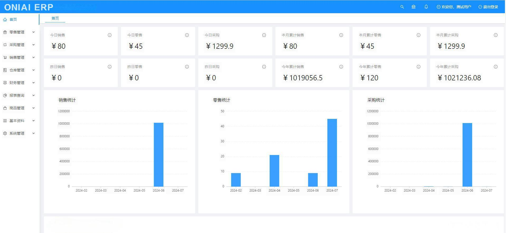
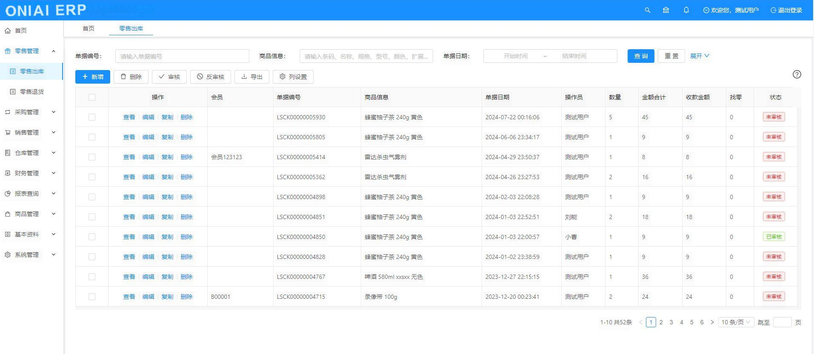
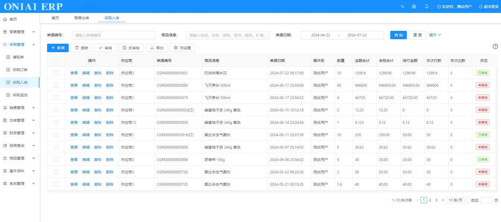
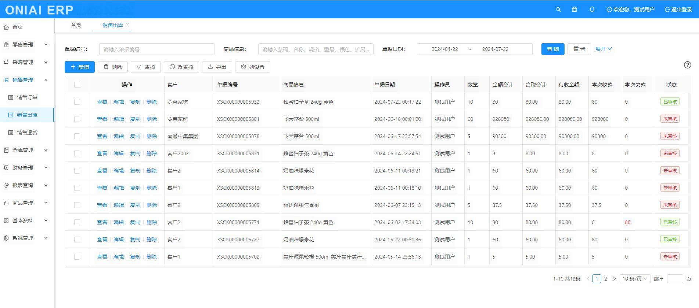
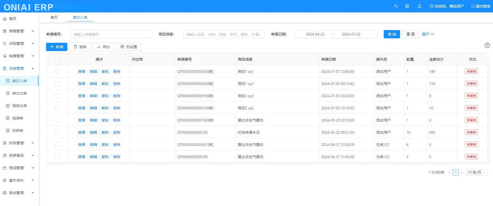
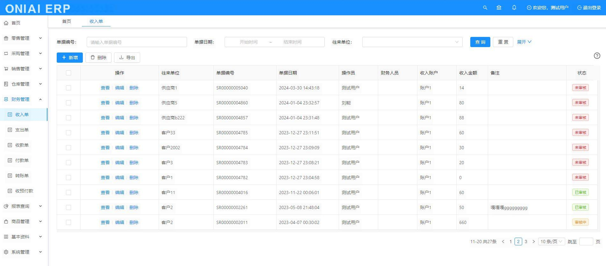
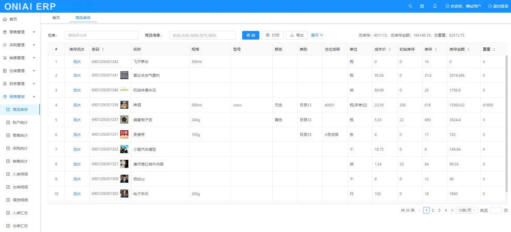
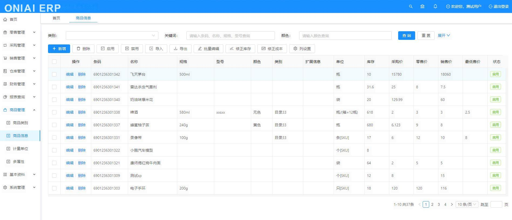
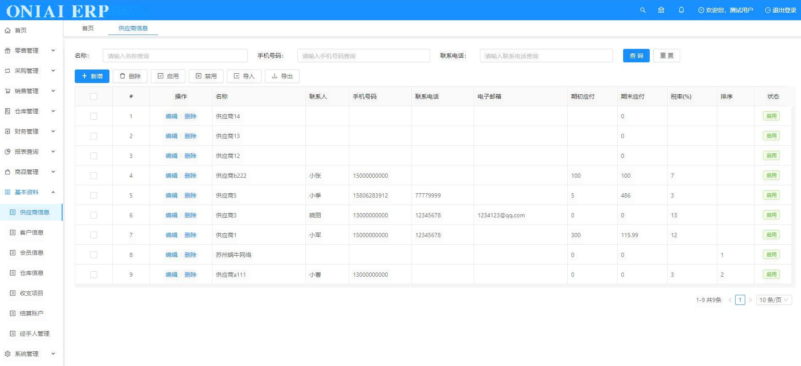
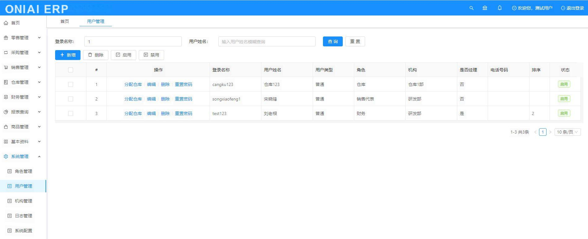

# 项目总述
* ONIAI ERP 是基于流行的Java8 及Spring boot2.0框架开发的ERP系统
* 目前有进销存、财务、报表、生产等功能，后面将会不断完善

# 技术框架
* 核心框架：SpringBoot 2.0.0
* 持久层框架：Mybatis 1.3.2
* 日志管理：SLF4J 1.7
* 前端框架：Vue 2.6.10
* UI框架: Ant-Design-Vue 1.5.2
* 模板框架: Jeecg-Boot 2.2.0
* 项目管理框架: Maven 3.2.3

# 开发环境
建议开发者使用以下环境，可以避免版本带来的问题
* IDE: IntelliJ IDEA 2019.2+和JetBrains WebStorm 2019.3+
* DB: Mysql 5.7.33
* JDK: JDK 1.8
* Node: Node 20.17.0
* Maven: Maven 3.2.3+
* Redis: 6.2.1
* Nginx: 1.12.2 

# 服务器环境
* 数据库：Mysql5.7.33
* JAVA平台：JRE1.8
* Redis库：redis6.2.1
* Nginx代理：nginx1.12.2
* 操作系统：Windows、Linux等

# 配套资料
* 需要用户手册请访问这里 https://www.gyjerp.com/thread-393-1-1.html
* 需要接口文档请查看这里 http://www.gyjerp.com/thread-428-1-1.html
* 为方便大家搭建运行环境，分享了下载地址 https://pan.baidu.com/s/1jlild9uyGdQ7H2yaMx76zw  提取码:814g
* 不会打包的小伙伴，请下载此打包后的文件 https://share.weiyun.com/NDJNLhry 密码：vd3aig
* 不会部署的小伙伴，请参考部署教程 http://www.gyjerp.com/thread-177-1-1.html

# 系统美图
* 首页

* 零售管理

* 采购管理

* 销售管理

* 仓库管理

* 财务管理

* 报表查询

* 商品管理

* 基本资料

* 系统管理

